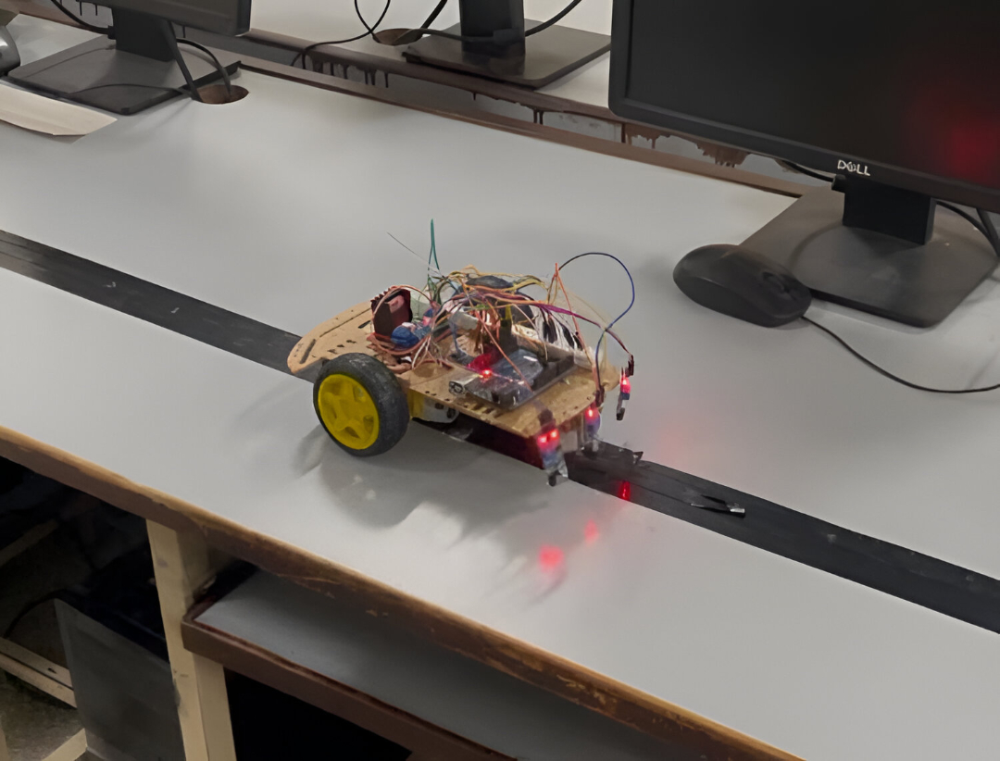

# Autonomous Line Following Robot
An Arduino-based autonomous line-following robot developed for indoor package delivery tasks in structured environments such as warehouses, hospitals, and offices. The robot follows a predefined path marked by a black line using infrared sensors and drives a dual DC motor setup via PWM-based motor control.

## 📖 Project Description
This project demonstrates the design, hardware integration, and software implementation of a low-cost indoor line-following robot. Using simple rule-based logic and modular hardware, the robot reliably tracks predefined paths while carrying small payloads across indoor environments. The design is suitable for educational purposes, prototyping, and micro-logistics automation.

## ⚙️ Features

- Accurate line tracking with 3 IR sensors (left, center, right)

- Smooth forward and turning motion with PWM-controlled DC motors

- Lightweight, stable chassis design

- Modular code structure for future expansion

- Designed for indoor package transportation

## 🔧 Hardware Components

| Component | Quantity |
| ----------- | ----------- |
| Arduino Nano (ATmega328P) | 1 |
| IR Line Sensors | 3 |
| L298N Motor Driver | 1 |
| DC Gear Motors | 2 |
| TT Gear Motors (3-6V) | 2 |
| Chassis & Wheels | 1 set |
| Battery Pack | 1 |
| Miscellaneous (Wiring, Connectors, Mounts) | - |

## 📊 Performance Summary
Line following accuracy: ~95% under controlled lighting

Payload capacity: Up to 200g

Average operational speed: ~0.4 m/s

## 🧪 Testing
The robot was tested on custom indoor tracks with both straight and curved paths. Package stability, motor synchronization, and sensor alignment were verified through multiple test cycles. The system demonstrated reliable line detection and smooth navigation in simulated indoor environments.

## 📸 Demonstration

## 💡 Future Work
Integration of obstacle detection

Wireless remote control (Wi-Fi/Bluetooth)

RFID-based destination matching

Self-charging capabilities

## 👥 Contributors
[Aleeza Rizwan](https://github.com/its-aleezA)

[Shaheer Afzal](https://github.com/ShaheerAfzal)

[Ibrahim Abdullah](https://github.com/Ibrahim5570)

Muhammad Asjad

## 📄 Project Report
The detailed system design, hardware configuration, control logic, and testing results are available in the full project report:

👉 [Project Report (PDF)](report/Project_Report.pdf)

## 💻 Source Code

The complete Arduino source code for this project is included in this repository:

- [`code/line_following_robot_code.ino`](code/line_following_robot_code.ino)

## 🔖 License
This project is open-sourced under the MIT License. See the LICENSE file for details.
